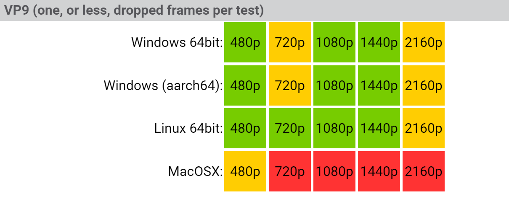

# About - Media Playback 

## Requirement

A playback test is successful if it drops one frame, or less, for the duration of the video.

## Summary 

The media playback summary is color coded according to how well it meets requirements:

* **green** - All playback speeds meet requirements
* **yellow** - Normal playback meets requirements, other speeds do not
* **red** - Normal playback fails: More than one dropped frame

### Example

You may click on any specfic platform for a breakdown.

## Details

The media playback dashboard attempts to summarize a large combinations of playback parameters:

* browser engine (3)
* codec (2)
* hardware platform (7)
* resolution/interlacing (12)
* playback speed (6)

The first two can be viewed by navigating to the relevant page.  The hardware/resolution are shown along the vertical/horizontal axis respectively.  Finally, the playback speed is packed into the color coding.
