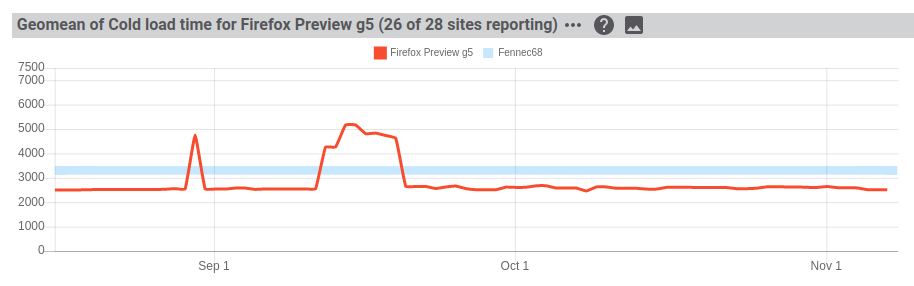
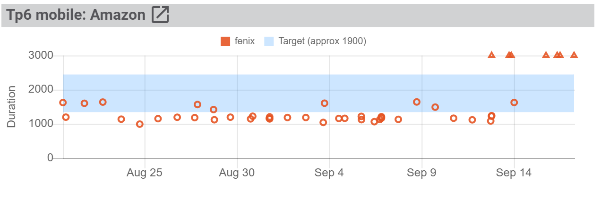
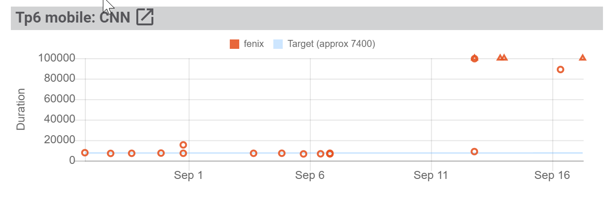
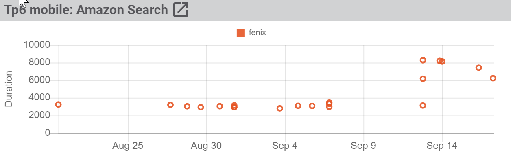

# About - Site Load Times

## Requirement

Pageload times are 20% better than Fennec64

## Summary Chart

The page load summary chart shows the geometric mean load time for a number of sites against a Fennec64 -20% range  

**Number of sites reporting**
 
In the example above, there are 28 candidates sites, but only 26 are reporting.  There are two reasons why a site is not reporting: Either the site test has been failing for over a week, or the Fennec64 test has not been running.  The specific test not reportng can be seen in the detailed breakdown (more below)
  
**Fennec64 -20% Range**

Fennec64 pageload times are shown as a range. For each site, the worst observed loadtime and best observed loadtime (min) from the past 6 weeks is found.  Then a geometric mean of all worst (max) and a best (min) reported sites is used to establish a range. 20% is subtracted from the range to show on the chart.

Fennec64 is only run once per week, and pageload times are highly variable (as seen by the range), so daily, or weekly, moving range is not possible.

**Geomean (red) line**

The statistic takes the median load time from all reporting sites run in a day and geometrically means those times to provide a daily number. 

More grainularity is not possible - not all sites are run at the same time, nor are all sites run the same number of times a day. 

## Detail Chart

Clicking on the triple dots (`...`) will show a per-site breakdown for the geomean summary.  Showing all candidate sites, whether reported or not.

In the above example the specific pageload test time are shown, and the fennec64 range for that site is also shown.

**Target Range**

The target range is derived from Fennec64: The worst observed load time (max) and best observed loadtime (min) from the past 6 weeks, for the given site, with 20% subtracted. 

**Missing Sites**

Not all sites are reported, you can identify the missing sites by scanning the charts: Either there will be no data, or data has been missing for a week, or the *Target is missing*. While missing data will be obvious when scanning, missing targets are a little harder. The target is missing if it is **missing from the legend**; some target ranges are quite thin, and easy to miss. There are two charts below, one is missing a target, the other is reported.

